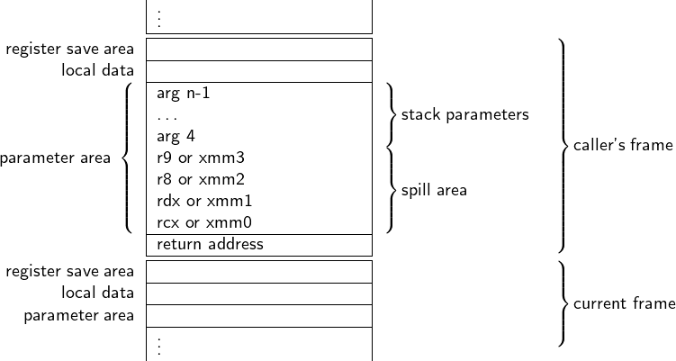
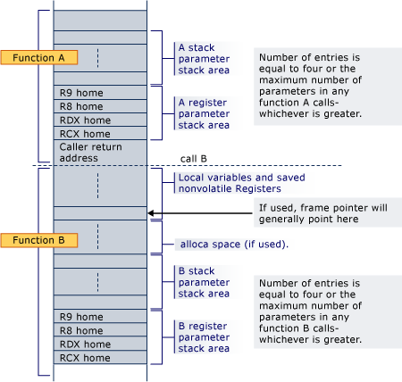
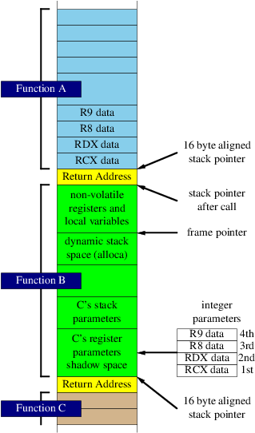
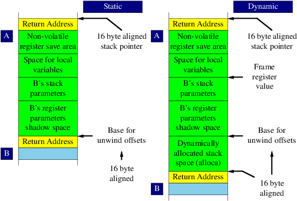
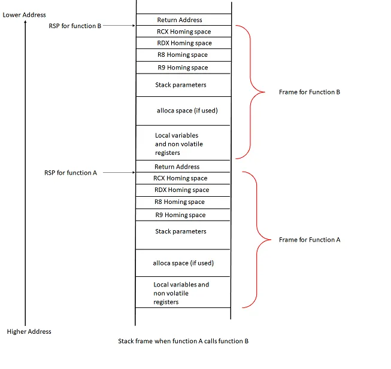
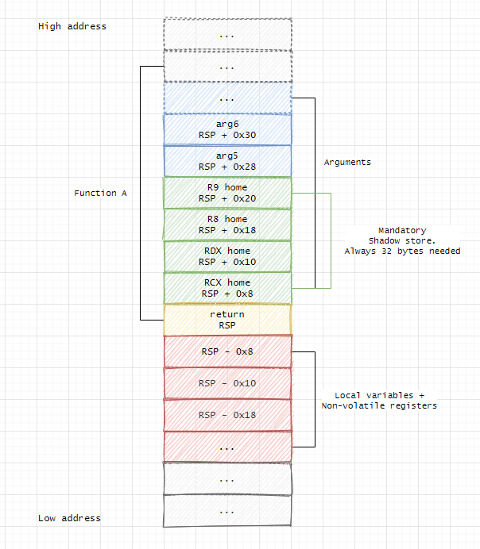

# Win64代码生成    

## MS Window X64调用约定  

#### 参数传递    

- 堆栈参数顺序：从右到左。  
- 调用方清理栈。  
- 前 4 个整数/指针参数通过 RCX、RDX、R8、R9（按从左到右的参数顺序）传递，其余参数压栈（为前 4 个寄存器参数在栈上预留了溢出/归宿区）。  
- 任意大小的“非平凡”C++ 聚合类型（按语言定义）通过指向其副本的指针间接传递。  
- 小于 64 位的聚合类型（结构体/联合）按等大小的整数方式传递。
- float 和 double 参数通过 XMM0–XMM3 传递。  
- 前 4 个参数按其类型走对应寄存器；当混合浮点与整数参数时，会跳过某些寄存器（例如：第一个参数在 RCX 或 XMM0，第二个在 RDX 或 XMM1，等等）。  
- 寄存器中的参数按右对齐放置。  
- 小于 64 位的参数不会做零扩展；如需请将包含垃圾的高位清零（但始终按 8 字节宽度传递）。  
- 大于 64 位的参数通过指向副本的指针传递（对聚合类型，调用方分配的内存必须 16 字节对齐）。  
- 如果被调用方对参数取地址，必须把前 4 个参数写回栈上的保留区；对于浮点参数，值必须同时存入整数寄存器和浮点寄存器。  
- 调用方清理栈，而不是被调用方（类似 cdecl）。  
- 栈始终 16 字节对齐——由于返回地址是 64 位，参数个数为奇数时栈已对齐。  
- 省略号（可变参数）调用会在整数寄存器和浮点寄存器中同时传递浮点值（单精度会按要求提升为双精度）。  
- 若参数总大小超过一页内存（通常 4K–64K），必须调用 chkstk。  

#### 返回值  

- 指针、整数或聚合类型（结构体/联合，≤ 64 位）的返回值通过 RAX 返回。  
- 浮点类型通过 XMM0 返回。  
- 对于任何 > 64 位的其他类型（或任意大小的非平凡 C++ 聚合），会传递一个隐藏的首参，指向返回值的地址（C++ 的 thiscall 中，它作为第二个参数，在 this 指针之后）。  


#### 堆栈布局  

堆栈帧始终以 16 字节对齐。堆栈紧跟在函数序言之后：

  

#### 来源    

> https://dyncall.org/docs/manual/manualse11.html    


## 一些栈帧布局示意图（来源网络）      





  
  


## 和SystemV区别      

> WindowsX64 省略了帧指针的使用，仅依赖 RSP（堆栈指针）进行堆栈作。帧指针通常被省略，但如果程序使用_alloca则 MSVC 将在局部区域变量下方创建一个帧指针。    

> Windows64回溯不依赖rbp链条，而是依赖pdata。    

> Windows64调用约定没有红区，但是有影子空间。    

> WIndows64统一了调用约定，所有调用约定声明都会编译为Windows64调用约定。简化了移植和维护。    

## 指令选择注意事项    

操作数不带方括号，表示操作数是直接数或者寄存器值。    
操作数带方括号，表示操作数是地址指向的值，方括号内的就是地址。  

需要显示声明操作数字节长度，除非其中有寄存器操作数，寄存器操作数已经暗示了操作数大小。（推荐做法是寄存器不加长度说明符，内存操作数都加长度说明符）            

lea和mov的区别是lea只计算地址，不访问地址指向的值。而mov对地址操作数会访问地址取值。   


## 影子空间    

> CRE：32字节影子空间。是前四个寄存器参数的home空间，同时也可以被叶子函数用来存放数据。    

> 在Win64（Microsoft x64 调用约定）下，寄存器参数 RCX/RDX/R8/R9 如果“需要一个稳定地址”（如可变参数、取址、Debug构建），会被 home 到它们在 shadow space 的固定槽位。    

## 寄存器保存和恢复    

> 非易失性寄存器需要在函数使用它们之前存储它们的值，而这个块就是它们去的地方。  
> 只需要保存使用到的寄存器。如果您的函数不使用某个非易失性寄存器，就不需要保存它。这是一个优化原则。    

保存顺序：通常按照寄存器编号顺序保存。  
恢复顺序：必须与保存顺序相反（LIFO - 后进先出）。  


## unwind info（展开信息）    

unwind info（展开信息）是给操作系统的“撤销栈帧/恢复寄存器”的元数据，用于异常处理、栈回溯、调试器/分析器走栈等。    

函数在序言（prologue）里对非易失（callee-saved）寄存器或栈指针的任何保存/修改，必须用对应的 unwind 码记录下来，这样异常展开时系统才能正确恢复调用者状态。  

只需要记录非易失寄存器，易失寄存器不需要记录。    

编译器会自动生成；手写汇编通常用 MASM 的 .seh_* 指令来告诉汇编器生成正确的 unwind info。    

```
; 所有函数定义在 .text 段
section .text
global func1, func2, func3

func1:
.func1_begin:
    push rbp
.func1_push_rbp:
    mov rbp, rsp
    ; ... 函数体
    pop rbp
    ret
.func1_end:

func2:
.func2_begin:
    push rbp
.func2_push_rbp:
    push rbx
.func2_push_rbx:
    ; ... 函数体
    pop rbx
    pop rbp
    ret
.func2_end:

func3:
    ; 简单叶子函数，无需 unwind info
    mov rax, rcx
    ret

; pdata区域  
section .pdata rdata align=4
    ; func1 的条目
    dd func1.func1_begin - ImageBase
    dd func1.func1_end - ImageBase
    dd func1_unwind - ImageBase
    
    ; func2 的条目
    dd func2.func2_begin - ImageBase
    dd func2.func2_end - ImageBase
    dd func2_unwind - ImageBase

; xdata区域  
section .xdata rdata align=4
func1_unwind:
    db 1    ; Version=1, Flags=0
    db (func1.func1_push_rbp - func1.func1_begin)  ; prolog 大小
    db 1    ; unwind codes 数量
    db 5    ; 帧寄存器=RBP
    ; unwind codes
    dw (func1.func1_push_rbp - func1.func1_begin) | (0x00 << 8) | (5 << 12)

func2_unwind:
    db 1    ; Version=1, Flags=0
    db (func2.func2_push_rbx - func2.func2_begin)  ; prolog 大小
    db 2    ; unwind codes 数量
    db 5    ; 帧寄存器=RBP
    ; unwind codes
    dw (func2.func2_push_rbx - func2.func2_begin) | (0x00 << 8) | (3 << 12)   ; PUSH RBX
    dw (func2.func2_push_rbp - func2.func2_begin) | (0x00 << 8) | (5 << 12)   ; PUSH RBP
```


## 溢出槽    

> 每个函数不一样，编译器动态决定spill slot区的长度，简单的函数不需要溢出溢出槽。    
> 槽位可被复用（活跃区间不重叠），总大小与布局均属实现细节，可能随编译器/优化改变。    


## 局部变量    

> “活跃区间不重叠”的局部变量可以共享同一块栈内存。编译器优化时会自动复用；纯手写汇编则需要你自己决定复用同一偏移，汇编器不会替你做活跃性分析。    

> 在 Win64（Microsoft x64 调用约定）下，寄存器参数 RCX/RDX/R8/R9 如果“需要一个稳定地址”（如可变参数、取址、Debug构建），会被 home 到它们在 shadow space 的固定槽位；一般的寄存器压力导致的溢出（spill）则放到编译器在“局部变量区”单独分配的 spill slots，不会把 shadow space 当作通用 spill 区。    

> CRE:局部变量区**通常**在寄存器保存区后面，或者说在地址低位，所以要确定寄存器保存区长度后，局部变量才能确定偏移量，所以寄存器分配阶段局部变量可使用符号地址，延迟栈布局。    


## 一种兼容RBP链的Windows64调用约定    

将用于Gizbox语言。RBP作为Callee保存寄存器的第一个寄存器。以支持RBP链。      
其余和Windows约定一致。    

```
高地址
+------------------+
| 参数5, 6, 7...    | <- 超出4个参数的部分
+------------------+
| Shadow Space     | <- 32字节（调用者分配）
| (4个8字节槽位)    |
+------------------+
| 返回地址          | <- call指令推入
+------------------+
| 保存的RBP         | <- 被调用者保存
+------------------+
| 保存的其他非易失性 | <- 被调用者保存
| 寄存器            |
+------------------+
| 局部变量          | <- 编译器分配
+------------------+
| 寄存器溢出槽位     | <- 编译器管理
+------------------+
| 对齐填充          | <- 保持16字节对齐
+------------------+ <- RSP指向这里
低地址
```


（END）  